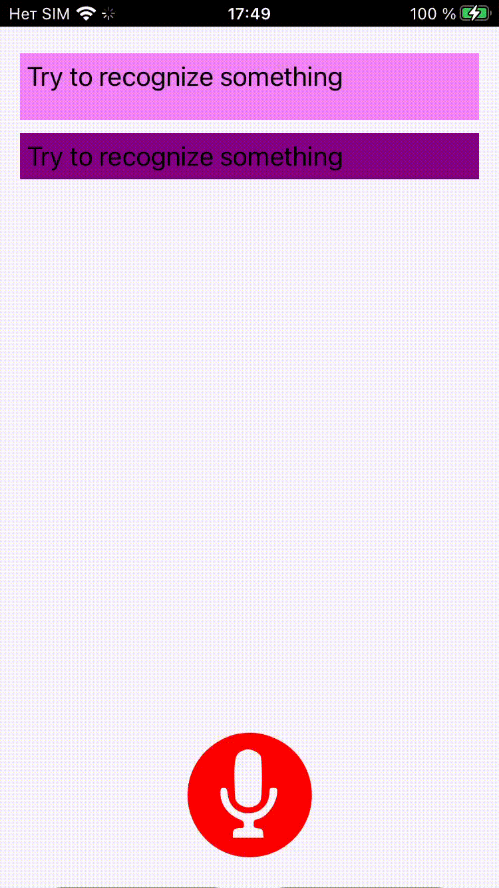

React native application
Proof of concep of voice recognition  apenAI  assistant.
How to use:
1. Press a mic(toggle) button  to start voice recgnition
2. In 3 sec after you stop talking your request  will be shown and will be requested to openAI API.
3. Once response will be received  it will be shown below and duplicated as a speach.
4. Once the speach replay will be stoped voice recognition will be activated again
5. If you would like to stop speach play you can use mic button

